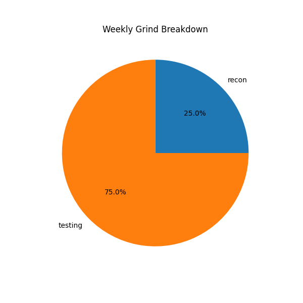

## How to use
```
git clone https://github.com/noob6t5/timetracker-cli

cd timetracker-cli

python3 tracker.py start coding

python3 tracker.py stop

```
## Todo will upd to rust with my previous Rust based CLI Todo tool : https://github.com/noob6t5/cli_todonotigram

## 🧠 Weekly Grind Time Breakdown



| Category  | Time Spent (hrs) |
|-----------|------------------|
| testing  |   0.03 hrs        |
| recon    |   0.01 hrs        |

## 📅 Daily Logs (Past 7 Days)

### 2025-07-23

| Category  | Time Spent (hrs) |
|-----------|------------------|
| recon    |   0.01 hrs        |
| testing  |   0.03 hrs        |

